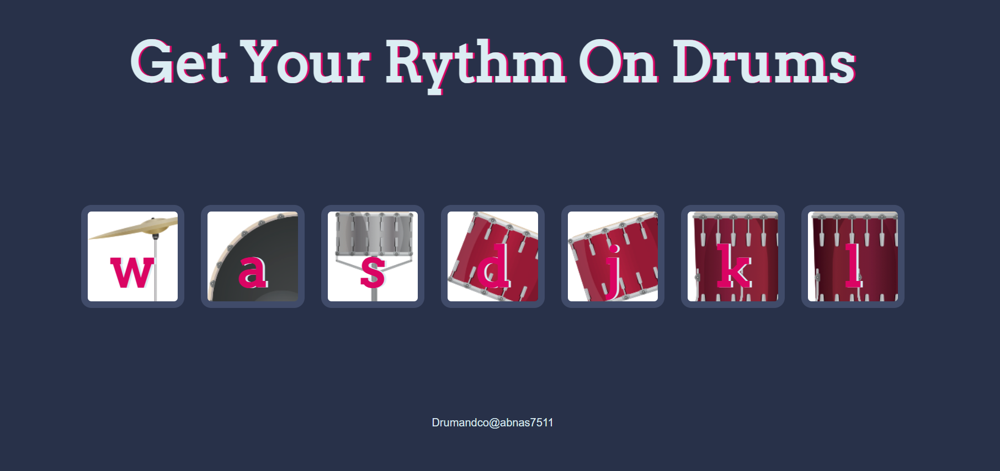

# Drum Kit Web Application

This is a simple drum kit web application that allows you to create beats by clicking on the drum buttons or pressing corresponding keyboard keys.

## Table of Contents

- [Description](#description)
- [Demo](#demo)
- [Features](#features)
- [Usage](#usage)
- [Contributing](#contributing)
- [License](#license)

## Description

This web application provides a virtual drum kit experience. You can click on the drum buttons or use keyboard keys to play different drum sounds. It's a fun and interactive way to create rhythms and enjoy music.

## Demo

You can try out the live demo of the Drum Kit here: [Live Demo](https://abnas7511.github.io/Drum-kit/)

## Features

- Click on drum buttons or use keyboard keys to produce drum sounds.
- Each drum has a unique sound associated with it.
- Interactive animations and button effects.
- Responsive design for various screen sizes.

## Usage

- Click on the drum buttons with your mouse to play sounds.
- Alternatively, press the keyboard keys associated with each drum to trigger sounds.

## Contributing
Contributions are welcome! If you'd like to contribute to this project, please follow these steps:

1. Fork the project on GitHub.
2. Create a new branch with a descriptive name for your feature or bug fix.
3. Make your changes and commit them.
4. Push your changes to your fork.
5. Create a pull request to submit your contribution.

## License
This project is licensed under the MIT License - see the LICENSE file for details.

